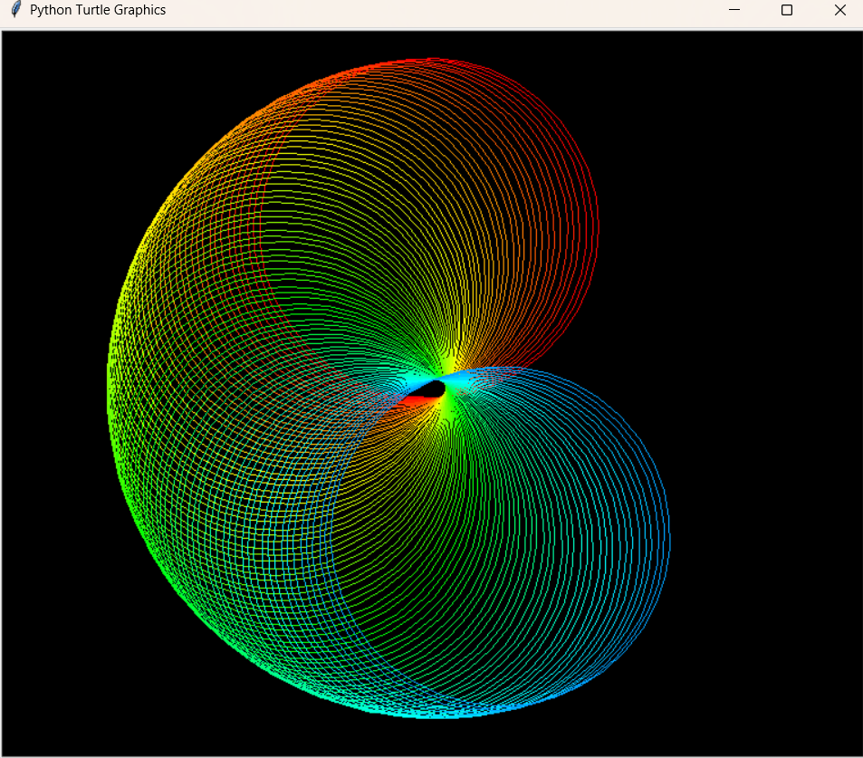
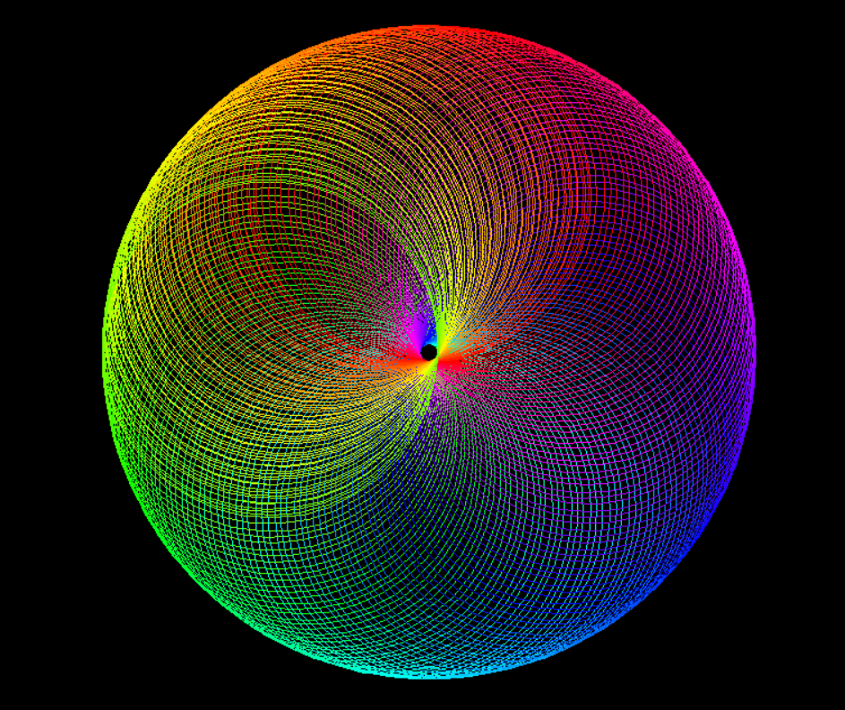

# 🎨 Colorful Turtle Spiral

A visually appealing Python project that generates a colorful spiral pattern using Turtle Graphics and HSV color transitions. The program combines geometric shapes, smooth color cycling, and animation to create a mesmerizing piece of generative art.

## 📌 Overview

This project uses Python's built-in Turtle Graphics library to draw multiple rotating circles while continuously changing colors across the HSV spectrum. The result is a vibrant neon-style spiral displayed on a black background.

## ✨ Features

- Dynamic rainbow color transitions
- Smooth animation effect
- Geometric spiral design
- Uses HSV-to-RGB color conversion
- Built entirely with Python standard libraries
- Beginner-friendly and easy to customize

## 🛠️ Technologies Used

- Python 3
- Turtle Graphics
- Colorsys

## 🚀 Getting Started

### Clone the Repository

```bash
git clone https://github.com/your-username/colorful-turtle-spiral.git
cd colorful-turtle-spiral
```

### Run the Project

```bash
python main.py
```

## 📖 How It Works

1. The screen background is set to black.
2. The turtle's drawing color changes gradually using HSV values.
3. Small rotations are applied after each iteration.
4. Multiple circles are drawn repeatedly to form a spiral-like structure.
5. The combination of motion and color transitions creates the final artwork.

## 📚 Concepts Demonstrated

- Nested loops
- Turtle Graphics
- Computer-generated art
- HSV and RGB color models
- Animation fundamentals
- Mathematical patterns in programming

## 📸 Output




## 🔧 Future Improvements

- User-controlled colors
- Adjustable spiral size
- Export artwork as an image
- Interactive controls using keyboard input

## 👨‍💻 Author

Ezz Fawzy Fathy Ahmed

---

If you found this project interesting, feel free to star the repository and explore the code.
